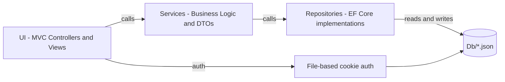
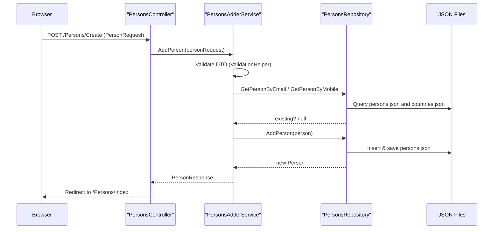

**ContactsManager — Clean Architecture ASP.NET MVC**

This repository is a sample Contacts Manager web application built with ASP.NET Core MVC and organized using a Clean Architecture approach (presentation → services → repositories → persistence). It demonstrates layering, dependency injection, DTOs, JSON file persistence, cookie authentication, and a suite of unit + integration tests.

**Contents**
- **UI:** ContactsManager.UI — ASP.NET MVC controllers, Views, Filters, Middlewares, Identity login/registration UI.
- **Core:** ContactsManager.Core — Domain entities, DTOs, service contracts, service implementations, helpers, and business logic.
- **Infrastructure:** ContactsManager.Infrastructure — file-backed repositories, JSON storage helpers, authentication storage.
- **Tests:** Service, Controller and Integration tests under `ContactsManager.ServiceTests`, `ContactsManager.ControllerTests`, and `ContactsManager.IntegrationTests`.

**Quick start**

Prerequisites: .NET SDK (6+). No SQL Server is required.

Build and run (Development):

```bash
dotnet build
cd ContactsManager.UI
dotnet run
```

Run all tests:

```bash
dotnet test
```

Integration tests run against the same file-backed storage and use `CustomWebApplicationFactory` to switch the app into `Testing` mode.

**High-level architecture**

- Presentation (UI): MVC Controllers, Views, Filters, Middlewares
- Application / Services: DTOs, validation, business logic (`Service_Contracts`, `Service_Classes`)
- Persistence: Repository interfaces and JSON file implementations (`Repository_Contracts`, `Repository_Classes`)
- Infrastructure: file storage helpers, JSON auth store, and seed files under `Db/`

Mermaid high-level component diagram



Sequence diagram: Add Person (high-level)



Key implementation points
- DI registration and middleware are configured in `ContactsManager.UI/Program.cs`.
- Root file storage lives in `Db/` and includes `countries.json`, `persons.json`, `users.json`, and `roles.json`.
- Repositories use JSON file helpers and rehydrate related `Country` data in memory. Services map between DTOs and entities using extension methods in DTO files.
- Validation is centralized in `ValidationHelper` (see `ContactsManager.Core/Helpers/ValidationHelper.cs`).
- Authentication/Authorization use cookie authentication plus JSON-backed user and role records configured in `Program.cs`.

Testing
- Unit tests: `ContactsManager.ServiceTests` uses Moq + AutoFixture to test services and validations.
- Integration tests: `ContactsManager.IntegrationTests` uses `CustomWebApplicationFactory` to switch the app into testing mode and exercise MVC endpoints without SQL Server.

Notable files to review (start here)
- [ContactsManager/ContactsManager.UI/Program.cs](ContactsManager/ContactsManager.UI/Program.cs)
- [ContactsManager/ContactsManager.Infrastructure/Storage/JsonFileStore.cs](ContactsManager/ContactsManager.Infrastructure/Storage/JsonFileStore.cs)
- [ContactsManager/ContactsManager.Infrastructure/Services/FileAuthService.cs](ContactsManager/ContactsManager.Infrastructure/Services/FileAuthService.cs)
- [ContactsManager/ContactsManager.Core/Services/PersonsAdderService.cs](ContactsManager/ContactsManager.Core/Services/PersonsAdderService.cs)
- [ContactsManager/ContactsManager.Infrastructure/Repositories/PersonsRepository.cs](ContactsManager/ContactsManager.Infrastructure/Repositories/PersonsRepository.cs)
- [ContactsManager/ContactsManager.Core/DTO/PersonRequest.cs](ContactsManager/ContactsManager.Core/DTO/PersonRequest.cs)
- [ContactsManager/ContactsManager.UI/Controllers/PersonsController.cs](ContactsManager/ContactsManager.UI/Controllers/PersonsController.cs)

Extension points and recommendations
- Consider adding a small admin seed routine if you want a default login the first time the app starts.
- Add tests for Filters and Middlewares, and integration tests covering register/login/access control with the new file-backed auth.

Maintenance notes
- The `Db/` folder is the persistence root. Keep it under source control if you want the application state and seed data to travel with the repo.

Contributing
- Follow existing patterns: keep business logic in `Service_Classes`, data access in `Repository_Classes`, and DTOs in `ContactsManager.Core/DTO`.

License & authors
- This README is informational for the sample app. Update license and author information as required.
