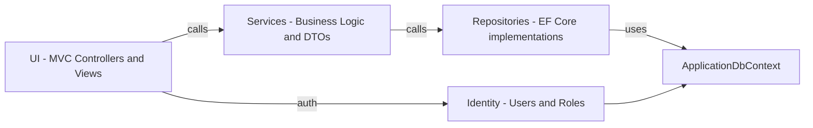
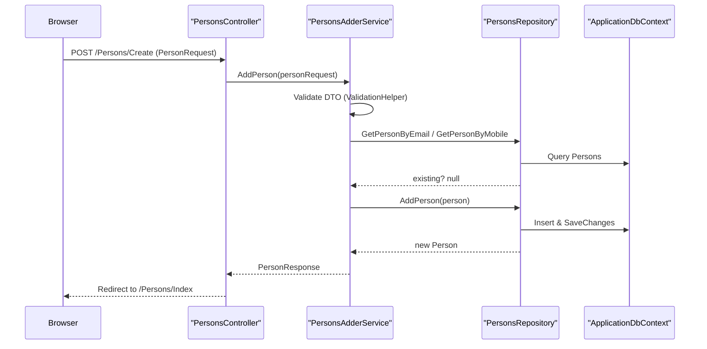

**ContactsManager — Clean Architecture ASP.NET MVC**

This repository is a sample Contacts Manager web application built with ASP.NET Core MVC and organized using a Clean Architecture approach (presentation → services → repositories → persistence). It demonstrates layering, dependency injection, DTOs, EF Core persistence, Identity authentication, and a suite of unit + integration tests.

**Contents**
- **UI:** ContactsManager.UI — ASP.NET MVC controllers, Views, Filters, Middlewares, Identity login/registration UI.
- **Core:** ContactsManager.Core — Domain entities, DTOs, service contracts, service implementations, helpers, and business logic.
- **Infrastructure:** ContactsManager.Infrastructure — EF Core `ApplicationDbContext`, repositories.
- **Tests:** Service, Controller and Integration tests under `ContactsManager.ServiceTests`, `ContactsManager.ControllerTests`, and `ContactsManager.IntegrationTests`.

**Quick start**

Prerequisites: .NET SDK (6+), SQL Server for regular runs (integration tests use in-memory DB).

Build and run (Development):

```bash
dotnet build
cd ContactsManager.UI
dotnet run
```

Run all tests:

```bash
dotnet test
```

Integration tests use an in-memory EF Core DB via `CustomWebApplicationFactory` so they can run without a SQL Server instance.

**High-level architecture**

- Presentation (UI): MVC Controllers, Views, Filters, Middlewares
- Application / Services: DTOs, validation, business logic (`Service_Contracts`, `Service_Classes`)
- Persistence: Repository interfaces and EF Core implementations (`Repository_Contracts`, `Repository_Classes`)
- Infrastructure: `ApplicationDbContext` (Identity + domain DbSets)

Mermaid high-level component diagram



Sequence diagram: Add Person (high-level)



Key implementation points
- DI registration and middleware are configured in `ContactsManager.UI/Program.cs`.
- `ApplicationDbContext` (ContactsManager.Infrastructure) extends `IdentityDbContext<ApplicationUser, ApplicationRole, Guid>` and seeds `Countries` from `CountriesData.json`.
- Repositories use EF Core and include related `Country` via `Include("Country")`. Services map between DTOs and entities using extension methods in DTO files.
- Validation is centralized in `ValidationHelper` (see `ContactsManager.Core/Helpers/ValidationHelper.cs`).
- Authentication/Authorization use ASP.NET Identity with cookie authentication and a fallback authorization policy configured in `Program.cs`.

Testing
- Unit tests: `ContactsManager.ServiceTests` uses Moq + AutoFixture to test services and validations.
- Integration tests: `ContactsManager.IntegrationTests` uses `CustomWebApplicationFactory` to replace the real DB with an in-memory DB and exercise MVC endpoints.

Notable files to review (start here)
- [ContactsManager/ContactsManager.UI/Program.cs](ContactsManager/ContactsManager.UI/Program.cs)
- [ContactsManager/ContactsManager.Infrastructure/DbContext/ApplicationDbContext.cs](ContactsManager/ContactsManager.Infrastructure/DbContext/ApplicationDbContext.cs)
- [ContactsManager/ContactsManager.Core/Services/PersonsAdderService.cs](ContactsManager/ContactsManager.Core/Services/PersonsAdderService.cs)
- [ContactsManager/ContactsManager.Infrastructure/Repositories/PersonsRepository.cs](ContactsManager/ContactsManager.Infrastructure/Repositories/PersonsRepository.cs)
- [ContactsManager/ContactsManager.Core/DTO/PersonRequest.cs](ContactsManager/ContactsManager.Core/DTO/PersonRequest.cs)
- [ContactsManager/ContactsManager.UI/Controllers/PersonsController.cs](ContactsManager/ContactsManager.UI/Controllers/PersonsController.cs)

Extension points and recommendations
- Prefer using strongly-typed `Include(p => p.Country)` instead of string-based includes (`Include("Country")`).
- Consider moving seed data loading out of `OnModelCreating` (file IO during model creation may fail in some environments) — use migrations or a dedicated seeder during startup.
- Add tests for Filters and Middlewares, and integration tests covering Identity flows (register/login/access control).

Maintenance notes
- `CountriesData.json` is required at runtime for initial seeding. Ensure the file is copied to output in project settings or referenced with a full path in production.

Contributing
- Follow existing patterns: keep business logic in `Service_Classes`, data access in `Repository_Classes`, and DTOs in `ContactsManager.Core/DTO`.

License & authors
- This README is informational for the sample app. Update license and author information as required.
